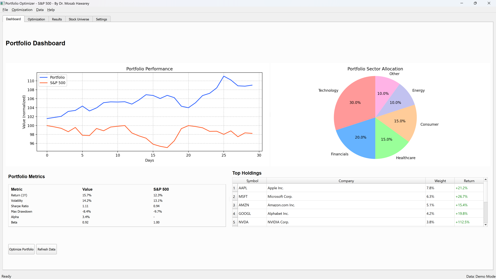
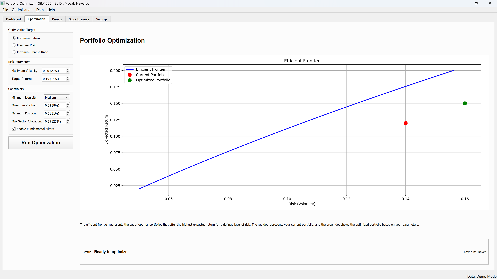
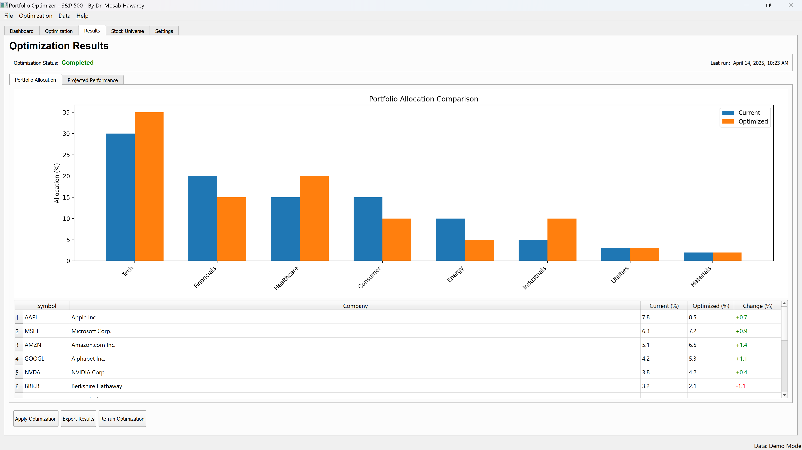
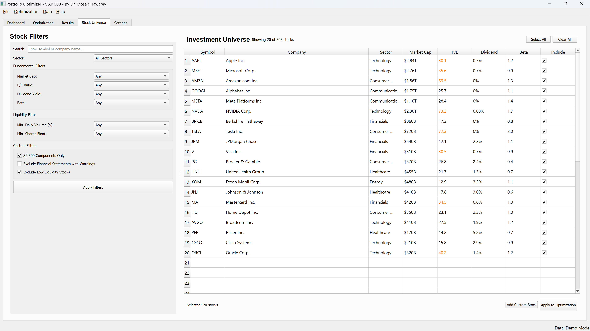

# Portfolio Optimizer — S&P 500

A PyQt5 desktop application for portfolio optimization across S&P 500 stocks, featuring Modern Portfolio Theory optimization, interactive dashboards, and configurable investment strategies.

## Screenshots

<p align="center">
  &nbsp;&nbsp;
</p>
<p align="center">
  &nbsp;&nbsp;
</p>

## Architecture

```
├── main.py              # Application entry point
├── run_application.py   # Alternative launcher
├── models/
│   ├── optimizer.py     # Portfolio optimization engine
│   ├── portfolio.py     # Portfolio data model
│   └── stock.py         # Stock data model
├── ui/
│   ├── main_window.py   # Main application window
│   ├── dashboard.py     # Performance dashboard
│   ├── optimization.py  # Optimization controls
│   ├── results.py       # Results display
│   ├── universe.py      # Stock universe selection
│   └── settings.py      # Configuration panel
└── utils/
    ├── data_loader.py   # Market data acquisition
    └── visualizations.py # Chart generation
```

## Features

- **S&P 500 Universe** — Select from full S&P 500 stock universe
- **Mean-Variance Optimization** — Efficient frontier computation
- **Interactive Dashboard** — Real-time portfolio analytics with PyQt5
- **Configurable Strategies** — Custom constraints, risk targets, and rebalancing
- **Performance Visualization** — Risk-return charts, allocation breakdowns

## Requirements

```
PyQt5
numpy
pandas
matplotlib
yfinance
scipy
```

## Usage

```bash
pip install PyQt5 numpy pandas matplotlib yfinance scipy
python main.py
```

## Author

**Dr. Mosab Hawarey** — [github.com/mhawarey](https://github.com/mhawarey)

## License

MIT License

## Disclaimer

For educational purposes only. Not financial advice.
